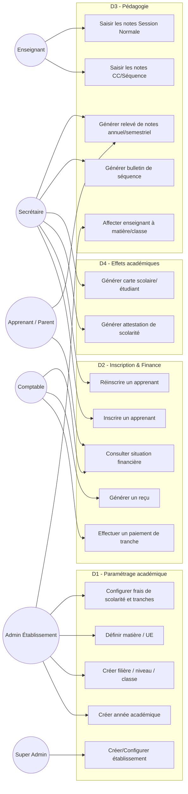
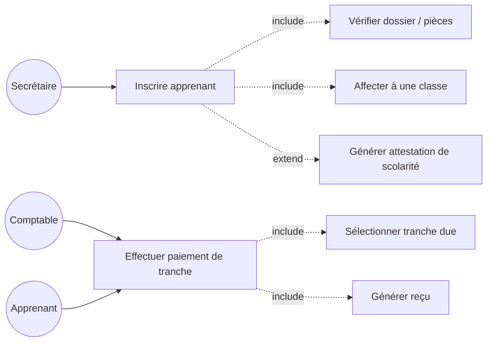
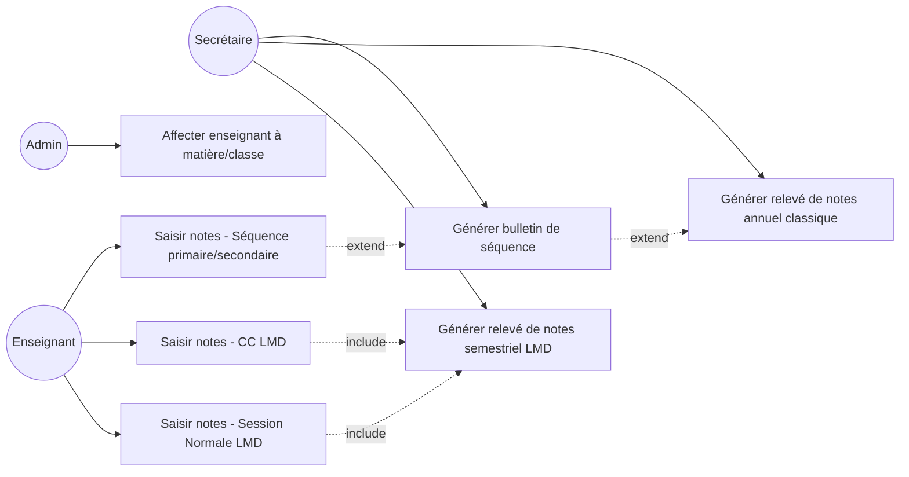
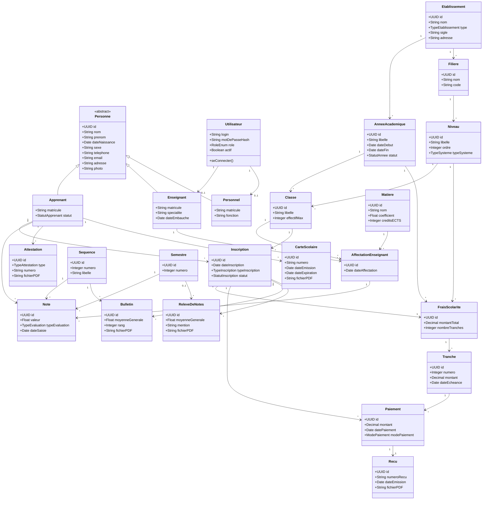
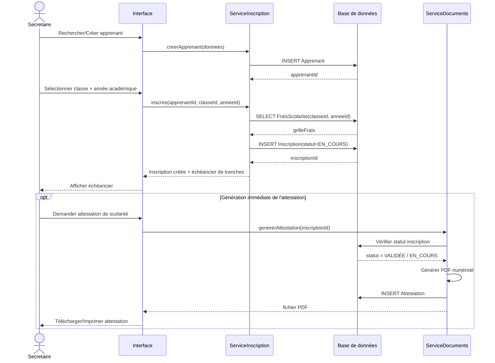
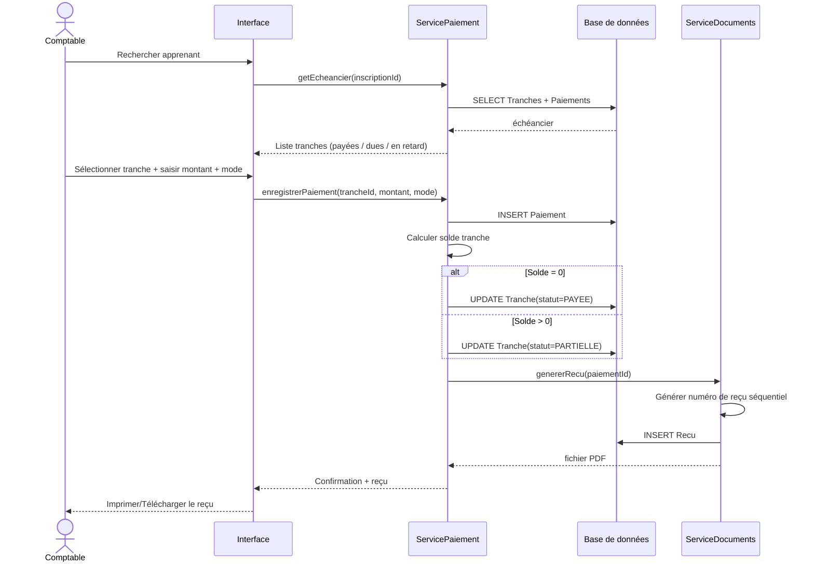
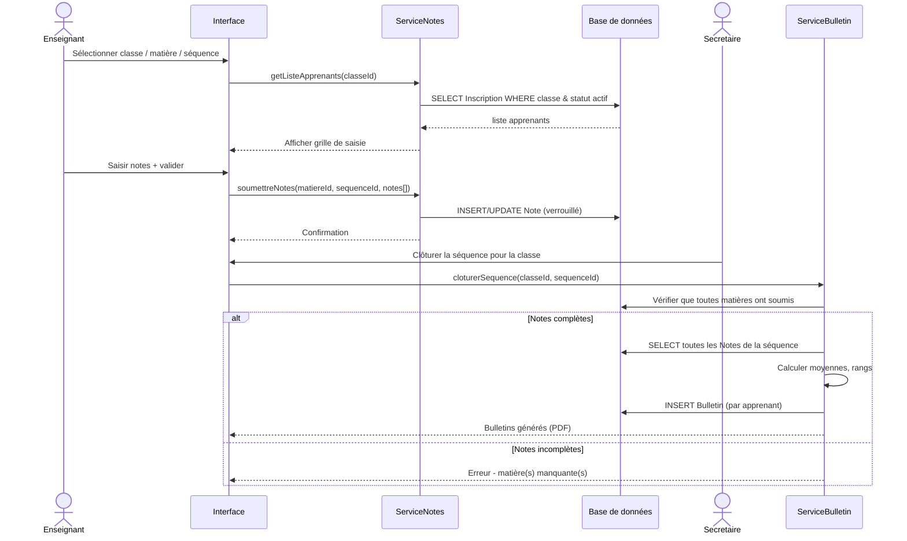
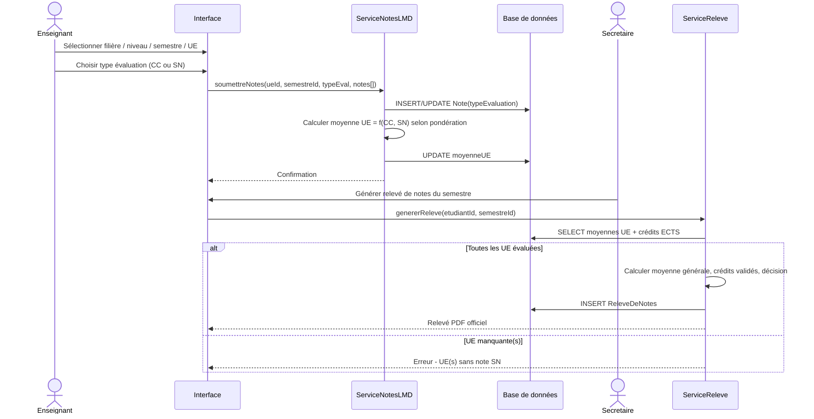
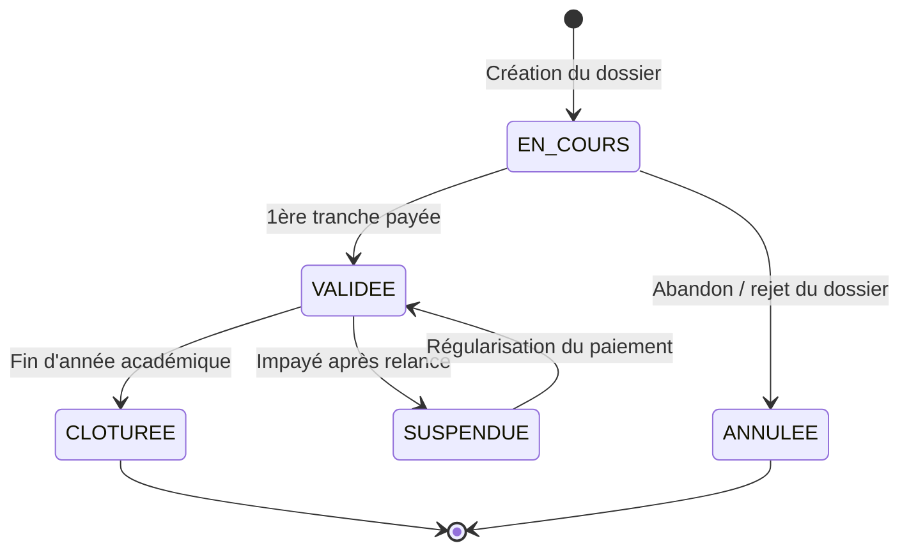
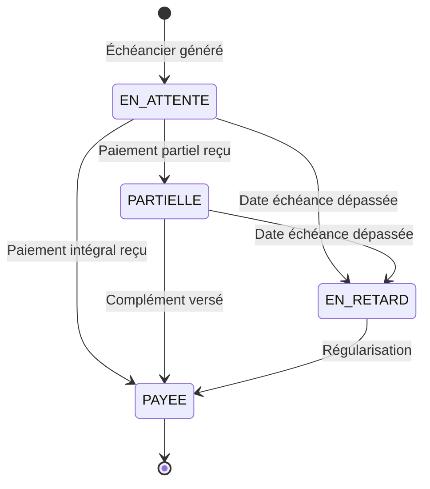

# DJAART SCHOOL — Analyse et Conception UML
### Système de gestion multi-établissements (Primaire, Secondaire, Universitaire, Centre de formation DQP/CQP)

---

## 1. Contexte et objectifs

DJAART SCHOOL est une plateforme multi-établissements destinée à gérer :

- **Primaire / Secondaire** : classes, séquences, bulletins.
- **Universitaire** : filières, système **LMD** (Licence-Master-Doctorat), semestres, notes de **CC** (Contrôle Continu) et de **Session Normale (SN)**, relevés de notes.
- **Centre de formation** : filières préparant aux **DQP** (Diplôme de Qualification Professionnelle) et **CQP** (Certificat de Qualification Professionnelle).

Le système doit couvrir 4 grands domaines fonctionnels transverses à tous les types d'établissements :

| Domaine | Contenu |
|---|---|
| **D1 — Paramétrage académique** | Établissements, années académiques, filières, niveaux/classes, matières/UE, frais de scolarité et tranches |
| **D2 — Inscription & Finance** | Inscription des apprenants, paiement en tranches, génération de reçus |
| **D3 — Pédagogie** | Affectation enseignant ↔ matière ↔ classe, saisie des notes (séquence ou CC/SN), génération bulletins/relevés |
| **D4 — Effets académiques** | Attestation de scolarité, carte scolaire/étudiant, relevé de notes |

---

## 2. Acteurs du système

| Acteur | Rôle |
|---|---|
| **Super Administrateur** | Gère les établissements, les comptes admin, la configuration globale |
| **Administrateur d'établissement** | Paramètre l'année académique, les classes/niveaux, les frais de scolarité (montant + découpage en tranches), affecte les enseignants aux matières |
| **Secrétaire / Chargé des inscriptions** | Inscrit les apprenants, édite les effets académiques (attestation, carte) |
| **Comptable / Caissier** | Encaisse les paiements de tranches, génère les reçus |
| **Enseignant** | Saisit les notes des apprenants pour les matières/UE qui lui sont affectées |
| **Apprenant / Étudiant / Parent** | Consulte son dossier, ses notes, ses bulletins/relevés, ses reçus (portail apprenant) |

---

## 3. Diagramme de cas d'utilisation

### 3.1 Vue globale

### 3.2 Zoom — Module Inscription & Paiement

### 3.3 Zoom — Module Pédagogie (Classique vs LMD)

---

## 4. Description détaillée des scénarios (fiches de cas d'utilisation)

### UC-01 — Configurer les frais de scolarité et les tranches (Admin)

| Élément | Description |
|---|---|
| **Acteur principal** | Administrateur d'établissement |
| **Objectif** | Définir le montant de la pension pour une classe/niveau donné, pour une année académique, et le découper en mensualités/tranches |
| **Préconditions** | L'année académique et la classe/niveau existent déjà |
| **Scénario nominal** | 1. L'admin sélectionne l'établissement, l'année académique et la classe/niveau. 2. Il saisit le montant total de la scolarité. 3. Il choisit le mode de paiement : **comptant** ou **par tranches**. 4. S'il choisit "par tranches", il définit le nombre de tranches, le montant et la date d'échéance de chacune (ex. 1ère tranche 40%, puis mensualités). 5. Le système valide que la somme des tranches = montant total. 6. Le système enregistre la grille tarifaire. |
| **Scénarios alternatifs** | A1 : Somme des tranches ≠ montant total → message d'erreur, retour à l'étape 4. A2 : Modification d'une grille déjà utilisée par des inscriptions → avertissement, création d'une nouvelle version plutôt qu'écrasement. |
| **Postconditions** | La grille de frais (FraisScolarite + Tranches) est disponible pour les inscriptions de cette classe/niveau/année |

---

### UC-02 — Inscrire un apprenant

| Élément | Description |
|---|---|
| **Acteur principal** | Secrétaire / Chargé des inscriptions |
| **Objectif** | Créer le dossier d'un apprenant et l'affecter à une classe pour une année académique |
| **Préconditions** | L'année académique est ouverte ; la classe a des places disponibles ; les frais de scolarité de la classe sont configurés |
| **Scénario nominal** | 1. La secrétaire crée ou recherche la fiche de l'apprenant (identité, filiation, documents). 2. Elle sélectionne l'établissement, l'année académique et la classe/niveau (filière + niveau + groupe pour université/centre). 3. Le système attribue un **matricule** unique et rattache automatiquement la **grille de frais** de la classe. 4. Le statut de l'inscription passe à "EN COURS". 5. Si un paiement initial est versé immédiatement, le système enchaîne sur UC-04 (paiement). 6. L'inscription est validée ("VALIDÉE") dès que la 1ère tranche obligatoire est réglée (règle paramétrable). |
| **Scénarios alternatifs** | A1 : Classe pleine → proposition d'une classe parallèle ou liste d'attente. A2 : Réinscription d'un apprenant déjà existant → le système réutilise le dossier et l'historique, ne recrée pas le matricule (sauf changement d'établissement). |
| **Postconditions** | Une Inscription est créée, liée à l'apprenant, la classe, l'année académique et la grille de frais |

---

### UC-03 — Réinscrire un apprenant

| Élément | Description |
|---|---|
| **Acteur principal** | Secrétaire |
| **Objectif** | Faire passer un apprenant à l'année académique/niveau suivant |
| **Préconditions** | L'apprenant a un dossier existant ; l'année académique précédente est soldée ou en cours de clôture |
| **Scénario nominal** | 1. Recherche de l'apprenant. 2. Le système propose le niveau supérieur (promotion automatique selon la moyenne, si activé) ou permet un choix manuel (redoublement). 3. Création d'une nouvelle Inscription liée à la nouvelle année académique/classe. 4. Rattachement de la nouvelle grille de frais. |
| **Postconditions** | Nouvelle inscription créée, historique des inscriptions précédentes conservé |

---

### UC-04 — Effectuer un paiement de tranche et générer le reçu

| Élément | Description |
|---|---|
| **Acteur principal** | Comptable / Caissier |
| **Objectif** | Encaisser le règlement d'une tranche de scolarité et produire un reçu |
| **Préconditions** | L'apprenant est inscrit et a des tranches dues |
| **Scénario nominal** | 1. Le comptable recherche l'apprenant (par matricule ou nom). 2. Le système affiche l'échéancier : tranches payées, en attente, en retard. 3. Le comptable sélectionne la tranche à régler (paiement total ou partiel de la tranche). 4. Il saisit le montant, le mode de paiement (espèces, mobile money, virement, chèque). 5. Le système enregistre le Paiement, met à jour le solde de la tranche (PAYÉE / PARTIELLE). 6. Le système génère automatiquement un **Reçu** numéroté (PDF), imprimable. |
| **Scénarios alternatifs** | A1 : Paiement partiel → la tranche reste "PARTIELLEMENT PAYÉE", un reçu partiel est émis. A2 : Montant saisi > solde dû → système propose d'affecter le surplus à la tranche suivante. A3 : Tranche déjà soldée → blocage de la saisie. |
| **Postconditions** | Un Paiement et un Reçu sont enregistrés ; le solde de l'apprenant est mis à jour |

---

### UC-05 — Affecter un enseignant à une matière/classe

| Élément | Description |
|---|---|
| **Acteur principal** | Administrateur d'établissement |
| **Objectif** | Associer un enseignant à une ou plusieurs matières/UE d'une classe pour l'année académique |
| **Préconditions** | L'enseignant est enregistré dans la plateforme ; les matières et classes existent |
| **Scénario nominal** | 1. L'admin sélectionne une classe. 2. Il liste les matières/UE de cette classe (selon le programme du niveau/filière). 3. Pour chaque matière, il choisit un enseignant. 4. Le système crée l'**Affectation** (classe + matière + enseignant + année académique). 5. L'enseignant voit désormais cette matière/classe dans son espace pour la saisie des notes. |
| **Scénarios alternatifs** | A1 : Matière déjà affectée à un autre enseignant → remplacement avec historisation. |
| **Postconditions** | L'enseignant peut saisir les notes de la matière pour cette classe |

---

### UC-06 — Saisir les notes (Séquence — Primaire/Secondaire)

| Élément | Description |
|---|---|
| **Acteur principal** | Enseignant |
| **Objectif** | Saisir les notes des apprenants d'une classe pour sa matière, à chaque séquence |
| **Préconditions** | L'enseignant est affecté à la matière/classe ; la séquence est ouverte |
| **Scénario nominal** | 1. L'enseignant sélectionne sa classe, sa matière et la séquence en cours. 2. Le système affiche la liste des apprenants inscrits et actifs. 3. L'enseignant saisit une note par apprenant (+ coefficient déjà défini par la matière). 4. Il valide et soumet. 5. Le système verrouille la saisie (modifiable seulement via demande à l'admin après soumission). |
| **Scénarios alternatifs** | A1 : Apprenant absent → note "ABS" gérée selon règle de l'établissement (0 ou neutralisée). A2 : Séquence clôturée → saisie bloquée. |
| **Postconditions** | Les notes de la séquence sont enregistrées et disponibles pour le calcul du bulletin |

---

### UC-07 — Saisir les notes CC / Session Normale (Système LMD — Université)

| Élément | Description |
|---|---|
| **Acteur principal** | Enseignant |
| **Objectif** | Saisir les notes de Contrôle Continu (CC) et de Session Normale (SN) par UE et par semestre |
| **Préconditions** | L'enseignant est affecté à l'UE ; le semestre est actif |
| **Scénario nominal** | 1. L'enseignant sélectionne la filière, le niveau (L1…M2), le semestre, l'UE. 2. Il choisit le type d'évaluation : **CC** ou **Session Normale**. 3. Il saisit les notes des étudiants inscrits à cette UE. 4. Le système calcule automatiquement la moyenne de l'UE selon la pondération paramétrée (ex. CC 40% + SN 60%). 5. Validation et verrouillage de la saisie. |
| **Scénarios alternatifs** | A1 : Étudiant non admis à la SN (assidu insuffisant) → blocage de saisie SN pour cet étudiant. A2 : Note SN < moyenne requise → l'UE est marquée "à rattraper", gérée en session de rattrapage. |
| **Postconditions** | Les notes CC et SN de l'UE sont enregistrées et utilisées pour le relevé de notes semestriel |

---

### UC-08 — Générer un bulletin de séquence

| Élément | Description |
|---|---|
| **Acteur principal** | Secrétaire (déclenchement) / Système (calcul) |
| **Objectif** | Produire le bulletin d'un apprenant après clôture d'une séquence |
| **Préconditions** | Toutes les matières de la classe ont soumis leurs notes pour la séquence |
| **Scénario nominal** | 1. La secrétaire (ou le système automatiquement) lance la clôture de la séquence pour une classe. 2. Le système calcule la moyenne pondérée par matière, la moyenne générale, le rang de l'apprenant dans la classe. 3. Le système génère le bulletin PDF individuel pour chaque apprenant. 4. Les bulletins sont archivés et consultables par l'apprenant/parent. |
| **Scénarios alternatifs** | A1 : Note manquante dans une matière → alerte, blocage de la clôture tant que non résolu (ou notation "NN" selon règle). |
| **Postconditions** | Un Bulletin est créé pour chaque apprenant de la classe pour cette séquence |

---

### UC-09 — Générer le relevé de notes (fin d'année classique / fin de semestre LMD)

| Élément | Description |
|---|---|
| **Acteur principal** | Secrétaire (déclenchement) / Système (calcul) |
| **Objectif** | Produire le relevé de notes officiel de l'apprenant |
| **Préconditions** | — *Primaire/Secondaire* : toutes les séquences de l'année sont clôturées. — *Université* : toutes les UE du semestre ont des notes CC + SN validées. |
| **Scénario nominal** | 1. Sélection de l'apprenant (ou de toute la classe/promotion). 2. Le système agrège : moyennes de séquences (classique) ou moyennes d'UE + crédits ECTS obtenus (LMD). 3. Calcul de la moyenne générale, de la mention/décision (admis, ajourné, redoublant, crédits validés). 4. Génération du document PDF officiel, numéroté, signé numériquement (cachet établissement). |
| **Scénarios alternatifs** | A1 : UE non validée → mention "à rattraper" sur le relevé, calcul des crédits restants (LMD). A2 : Relevé déjà généré → nouvelle version horodatée, ancienne archivée. |
| **Postconditions** | Un ReleveDeNotes est créé et archivé, disponible en téléchargement |

---

### UC-10 — Générer l'attestation de scolarité

| Élément | Description |
|---|---|
| **Acteur principal** | Secrétaire |
| **Objectif** | Délivrer une attestation prouvant que l'apprenant est régulièrement inscrit |
| **Préconditions** | L'apprenant possède une Inscription au statut "VALIDÉE" pour l'année académique en cours |
| **Scénario nominal** | 1. La secrétaire recherche l'apprenant. 2. Le système vérifie que l'inscription est active/validée. 3. Elle choisit le type d'attestation (scolarité, fréquentation, réussite). 4. Le système génère le document PDF pré-rempli (identité, classe, année académique, numéro d'attestation unique) et l'archive. |
| **Scénarios alternatifs** | A1 : Inscription non validée (paiement insuffisant) → blocage ou attestation "sous réserve" selon politique de l'établissement. |
| **Postconditions** | Une Attestation numérotée est générée et archivée |

---

### UC-11 — Générer la carte scolaire / d'étudiant

| Élément | Description |
|---|---|
| **Acteur principal** | Secrétaire |
| **Objectif** | Émettre la carte d'identification de l'apprenant |
| **Préconditions** | Inscription validée, photo de l'apprenant disponible |
| **Scénario nominal** | 1. Recherche de l'apprenant. 2. Le système pré-remplit le visuel de la carte (photo, matricule, nom, classe/filière, établissement, QR code, date de validité = fin d'année académique). 3. Génération du fichier (PDF prêt à imprimer / format carte). 4. Enregistrement dans l'historique des cartes émises. |
| **Scénarios alternatifs** | A1 : Carte perdue → réémission avec incrémentation d'un numéro de duplicata. |
| **Postconditions** | Une CarteScolaire est générée et liée à l'apprenant |

---

## 5. Diagramme de classes (modèle du domaine)

**Notes de modélisation :**
- `Niveau.typeSysteme` distingue **CLASSIQUE** (primaire/secondaire, utilise `Sequence`) de **LMD** (université, utilise `Semestre` + `TypeEvaluation` CC/SN).
- `Matiere` porte `creditsECTS` uniquement significatif en mode LMD ; en mode classique on utilise `coefficient`.
- `FraisScolarite` est défini par couple (Niveau, AnnéeAcademique), permettant à l'admin de fixer un montant différent chaque année.
- Le **Centre de formation (DQP/CQP)** réutilise exactement le même modèle : `Filiere` = filière de formation, `Niveau` = le diplôme visé (DQP ou CQP), `Semestre`/`Sequence` selon le découpage choisi par l'établissement.

---

## 6. Diagrammes de séquence

### 6.1 Inscription d'un apprenant + génération de l'attestation

### 6.2 Paiement d'une tranche + génération du reçu

### 6.3 Saisie des notes (classique) et génération du bulletin

### 6.4 Saisie CC/SN (LMD) et génération du relevé de notes semestriel

---

## 7. Diagrammes d'état

### 7.1 Cycle de vie d'une Inscription

### 7.2 Cycle de vie d'une Tranche de paiement

---

## 8. Dictionnaire de données (extrait des entités clés)

| Entité | Attribut clé | Règle métier |
|---|---|---|
| `Apprenant` | `matricule` | Généré automatiquement, unique par établissement |
| `FraisScolarite` | `montantTotal`, `nombreTranches` | Configuré uniquement par un **Admin**, par (Niveau, AnnéeAcadémique) |
| `Tranche` | `montant` | Somme des tranches = `montantTotal` de `FraisScolarite` (contrôle bloquant) |
| `Inscription` | `statut` | Passe à `VALIDEE` seulement si la règle de validation (ex : 1ère tranche réglée) est respectée |
| `Note` | `typeEvaluation` | `SEQUENCE` (classique) ou `CC` / `SESSION_NORMALE` (LMD) — jamais mélangés dans un même établissement |
| `Bulletin` | `rang` | Recalculé à chaque clôture de séquence, sur l'ensemble des apprenants actifs de la classe |
| `ReleveDeNotes` | `mention` | Calculée selon barème (classique : Excellent/Bien/Passable… ; LMD : Admis/Ajourné + crédits ECTS validés) |
| `Attestation` / `CarteScolaire` | `numero` | Séquence unique par établissement, non réutilisable (traçabilité/audit) |

---

## 9. Recommandations d'architecture technique

- **Architecture** : API REST (backend) + Frontend web (admin/secrétariat/enseignants) + portail apprenant/parent, éventuellement application mobile pour les enseignants (saisie de notes hors-ligne synchronisable).
- **Multi-tenant** : chaque `Etablissement` est un tenant logique — toutes les requêtes sont filtrées par `etablissementId` (isolation stricte des données entre écoles).
- **Génération de documents** : moteur de templates PDF (reçus, bulletins, relevés, attestations, cartes) avec numérotation séquentielle horodatée et QR code de vérification d'authenticité.
- **Gestion des rôles** : RBAC (Role-Based Access Control) — un enseignant ne voit que ses classes/matières affectées ; un comptable ne voit que le module financier ; un admin ne configure que son propre établissement (sauf Super Admin).
- **Journalisation (audit trail)** : toute saisie de note, tout paiement et toute génération de document doivent être tracés (qui, quand, quoi) — essentiel pour un système académique/financier.
- **Verrouillage des données figées** : une fois une séquence/semestre clôturé(e) et un bulletin/relevé généré, les notes sources doivent être verrouillées (modification uniquement via processus de correction tracé).

---

*Document réalisé comme base d'analyse et de conception (spécifications fonctionnelles, cas d'utilisation, diagramme de classes, diagrammes de séquence et d'état) pour le développement du système DJAART SCHOOL.*
